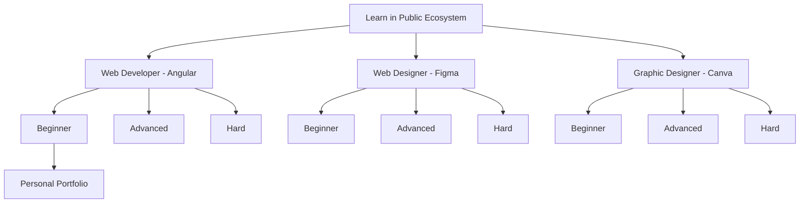

# Ecosystem Map

This map visualizes the structure of the Learn in Public Ecosystem, showing roles, difficulty levels, and the flow of projects.

```mermaid
flowchart TD
    Root[Learn in Public Ecosystem]
    Root --> WD[Web Developer - Angular]
    Root --> FD[Web Designer - Figma]
    Root --> GD[Graphic Designer - Canva]

    %% Web Developer Track
    WD --> WD_B[Beginner]
    WD --> WD_A[Advanced]
    WD --> WD_H[Hard]

    %% Web Designer Track
    FD --> FD_B[Beginner]
    FD --> FD_A[Advanced]
    FD --> FD_H[Hard]

    %% Graphic Designer Track
    GD --> GD_B[Beginner]
    GD --> GD_A[Advanced]
    GD --> GD_H[Hard]

    %% Example Project Connection (Web Developer Beginner)
    WD_B --> PersonalPortfolio[Personal Portfolio]
```
