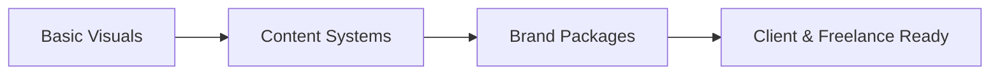

# Graphic Designer (Canva) — Project Roadmap

This roadmap is for students with:
Canva basics, template knowledge, and color theory understanding.

The goal is to move from **single designs**
to **repeatable, sellable visual systems**.

---

## Learning Progression

---

## 🟢 Beginner Projects (Visual Consistency)

**Goal:** consistency in visual identity and basic design principles.

| Project Name | Creative Focus | Skills Proven & Outcomes |
| :--- | :--- | :--- |
| **1. Personal Brand Kit** | Color Usage, Typography Pairing | Understanding branding basics and establishing a visual identity. |
| **2. Social Media Post Series** | Layout Rhythm, Consistency | Maintaining visual consistency across multiple assets. |

> **Resume Signal**
> “Designed branded visual assets using Canva.”

---

## 🟡 Advanced Projects (Scalable Content)

**Goal:** Move from one-off designs to systems that scale.

| Project Name | Creative Focus | Skills Proven & Outcomes |
| :--- | :--- | :--- |
| **1. Creator Content System** | Repeatability, Templates | Designing at scale and creating reusable content workflows. |
| **2. Marketing Campaign Assets** | Systems over Single Designs | Understanding how to support a broader marketing campaign visually. |

> **Resume Signal**
> “Developed reusable Canva content systems for creators and campaigns.”

---

## 🔴 Hard Projects (Professional & Sellable Work)

**Goal:** Deliver professional, monetizable work for clients.

| Project Name | Creative Focus | Skills Proven & Outcomes |
| :--- | :--- | :--- |
| **1. Client-Ready Brand Package** | Client Delivery, Polish | Working with real client requirements and delivering professional packages. |
| **2. Sellable Canva Template Pack** | Product Thinking, Monetization | Understanding product design and monetizing design skills. |

> **Resume Signal**
> “Delivered complete brand visual packages and sellable template products.”

---

## How to Use This Roadmap

1. Follow project guides strictly
2. Rebuild assets independently
3. Publish work on LinkedIn and Behance
4. Treat every project as client-ready

This roadmap prepares you for **freelance, creator, and brand roles**.
