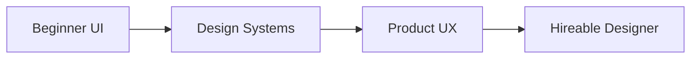

# Web Designer (Figma) — Project Roadmap

This roadmap is for students with:
Basic Figma knowledge, color theory, and typography fundamentals.

The goal is to move from **screens** → **systems** → **product-level UI**.

---

## Learning Progression

---

## 🟢 Beginner Projects (Visual Foundations)

**Goal:** Establish a strong eye for visual hierarchy and layout.

| Project Name | Design Focus | Skills Proven & Outcomes |
| :--- | :--- | :--- |
| **1. Personal Portfolio UI** | Layout Clarity, Spacing | Understanding spacing, alignment, and creating clean, readable screens. |
| **2. Marketing / SaaS Landing Page** | Typography, Visual Hierarchy | Guiding user attention effectively through type and composition. |

> **Resume Signal**
> “Designed responsive web interfaces using Figma.”

---

## 🟡 Advanced Projects (System Thinking)

**Goal:** Shift from designing single screens to designing scalable systems.

| Project Name | Design Focus | Skills Proven & Outcomes |
| :--- | :--- | :--- |
| **1. Website Design System** | Reusability, Consistency | Ability to create and maintain a consistent design language at scale. |
| **2. Dashboard UI Design** | Component Logic, Data Display | Understanding complex components and thinking beyond individual screens. |

> **Resume Signal**
> “Created reusable design systems and dashboard interfaces.”

---

## 🔴 Hard Projects (Product-Level Design)

**Goal:** Master end-to-end product design and developer collaboration.

| Project Name | Design Focus | Skills Proven & Outcomes |
| :--- | :--- | :--- |
| **1. Full SaaS Product UI** | UX Flows, Product Structure | Designing complete products with user flows and interactive states. |
| **2. Developer Handoff & Specs** | Documentation, Collaboration | Industry-readiness in collaborating with developers and delivering specs. |

> **Resume Signal**
> “Designed end-to-end SaaS product interfaces with developer-ready handoff.”

---

## How to Use This Roadmap

1. Follow guides in `/guide/en` or `/guide/hi-en`
2. Do NOT jump to high-fidelity early
3. Treat every project as a case study
4. Publish final work on Dribbble or Behance

This roadmap prepares you for **real UI/UX roles**, not just visuals.
