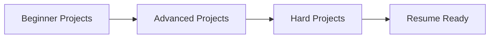

# Web Developer Angular — Project Roadmap

This roadmap is designed for students with knowledge of:
HTML, CSS, JavaScript, and basic Angular.

Projects are structured to move from **foundational confidence**
to **resume-highlight, interview-ready work**.

---

## Learning Progression

## 🟢 Beginner Projects (Foundations)

**Goal:** Master the basics of structure, style, and simple logic.

| Project Name | Key Technical Focus | Skills Proven & Outcomes |
| :--- | :--- | :--- |
| **1. [Personal Portfolio Website](../web-developer-angular/beginner/personal-portfolio)** | Semantic HTML, CSS Layouts | Ability to structure real pages and manage whitespace/layout effectively. |
| **2. Business Landing Page** | Responsiveness, Basic JS Logic | Understanding of responsive design principles and adding basic interactivity. |

> **Resume Signal**
> “Built responsive websites using HTML, CSS, and JavaScript.”

---

## 🟡 Advanced Projects (Structure + Logic)

**Goal:** Build multi-page systems with reusable code and user data handling.

| Project Name | Key Technical Focus | Skills Proven & Outcomes |
| :--- | :--- | :--- |
| **1. Multi-Page Business Website** | Multi-page Architecture, Reusable Styles | Organizing larger codebases and maintaining consistent styling across pages. |
| **2. Form-Driven Website** | Form Logic, Validation | Understanding UX flow and handling user input safely and effectively. |

> **Resume Signal**
> “Developed multi-page websites with structured CSS and client-side validation.”

---

## 🔴 Hard Projects (Interview & Portfolio Highlights)

**Goal:** Create complex, scalable applications that simulate real-world software.

| Project Name | Key Technical Focus | Skills Proven & Outcomes |
| :--- | :--- | :--- |
| **1. Admin Dashboard UI** | Complex Layouts, Grid Systems | Ability to think in systems and specific UI complexity handling (Frontend Only). |
| **2. Angular Mini Application** | Angular Fundamentals, State | Readiness for framework-based development and component architecture. |

> **Resume Signal**
> “Built dashboard-style interfaces and component-based applications.”

---

## How to Use This Roadmap

1. Complete projects **in order**
2. Follow `/guide` before checking `/solution`
3. Rebuild each project in your own GitHub repo
4. Share progress publicly

This roadmap is **mandatory before moving to modern frameworks**.
