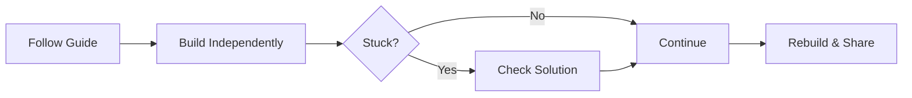

# Mermaid Diagram Usage Guide

Mermaid diagrams are used to make the ecosystem **self-navigable**
and reduce reliance on verbal explanation.

---

## When Mermaid Is Required

Use Mermaid diagrams when explaining:

- Navigation
- Flow
- Progression
- Decision paths
- Learning discipline

If something has steps → diagram it.

---

## Approved Diagram Types

- flowchart
- stateDiagram
- sequenceDiagram (rare)

Avoid over-decorating.

---

## Standard Style Guidelines

- Left-to-right flow preferred
- Clear node labels
- No excessive branching
- Keep diagrams readable on GitHub

---

## Mandatory Locations

Mermaid diagrams must appear in:

- Root README.md
- ecosystem-map.md
- roadmap/*.md
- project README.md (learning flow)

---

## Example: Learning Flow

## Rules

- Diagrams must reflect reality
- Diagrams must match written instructions
- Do NOT use Mermaid decoratively

## Why Mermaid Is Mandatory

- Improves clarity
- Reduces confusion
- Helps visual learners
- Makes the system scalable
