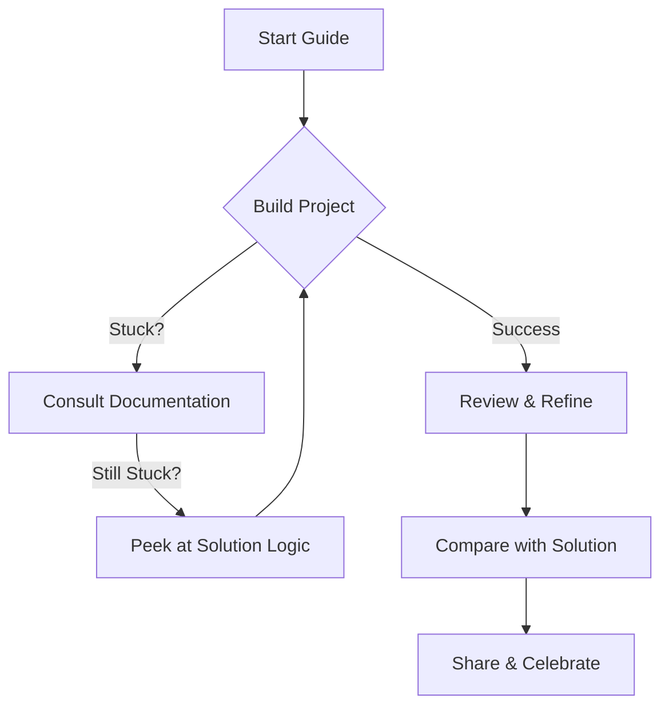

# Personal Portfolio Code

Welcome to the **Personal Portfolio** project! This project is designed to help you build a professional, clean, and modern personal portfolio website using only HTML, CSS, and Vanilla JavaScript.

## 🎯 What is this?

This is a **Project-Based Learning** module. It is NOT a step-by-step tutorial where you just copy code. Instead, we provide you with a **Guide** that helps you think like a developer, plan your approach, and solve problems creatively.

## 🚀 How to Use This Project

1.  **Start with the Guide**: Go to the `guide/` folder. Read the English (`guide/en/`) or Hinglish (`guide/hi-en/`) version.
2.  **Plan & Build**: Follow the planning and execution steps in the guide. Write your own code.
3.  **Get Stuck?**: If you are completely stuck, check the logic or hints in the guide.
4.  **Reference Solution**: Only look at the `solution/` folder if you have tried everything else or want to compare your finished work with a reference implementation. **Do not copy-paste.**
5.  **Reflect**: After finishing, answer the questions in `reflection.md`.

## 🔄 Learning Flow

## 📁 Structure

- `guide/`: Your learning path. Start here!
- `solution/`: Reference code (HTML, CSS, JS). Use wisely.
- `reference/`: Screenshots and assets.
- `project-intent.md`: Why this project exists.
- `reflection.md`: Questions to test your understanding.

Happy Coding! 🚀
